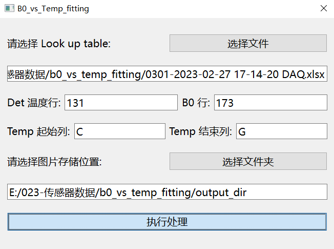

# README.md

***

***

## 项目简介

该仓库是使用 pyqt6 创建的一个传感器数据处理可交互软件，可以供使用者通过图形界面交互的方式来实现目标文件、输出位置等相关信息的选择，并对 xlsx 文件中的传感器数据进行提取和函数拟合，把相关数据和图片进行输出。

## **PyQt6** 的开发流程

1、用 QT 设计师绘制界面保存成 ui 文件

2、用 pyuic6 把 ui 文件转换成 python 文件

3、界面与逻辑分离的方法编写主程序

4、编写信号处理函数（点击按钮做操作）

5、使用 pyinstaller 打包成 exe 程序

## 各文件介绍

1. 0301-2023-02-27 17-14-20 DAQ.xlsx 是待处理的 xlsx 文件。
2. compute_b0.ui 是利用 pyqt6 的 designer.exe 设计的可视化交互界面。
3. compute_b0.py 是利用 pyuic6 把 compute_b0.ui 文件转换成的 python 文件
4. create_jpg.py 是实现 xlsx 中数据的处理、作图等功能的主要文件。
5. compute_b0_main.py 是界面与逻辑分离的方法编写的传感器数据处理主程序。

## 软件交互界面展示

